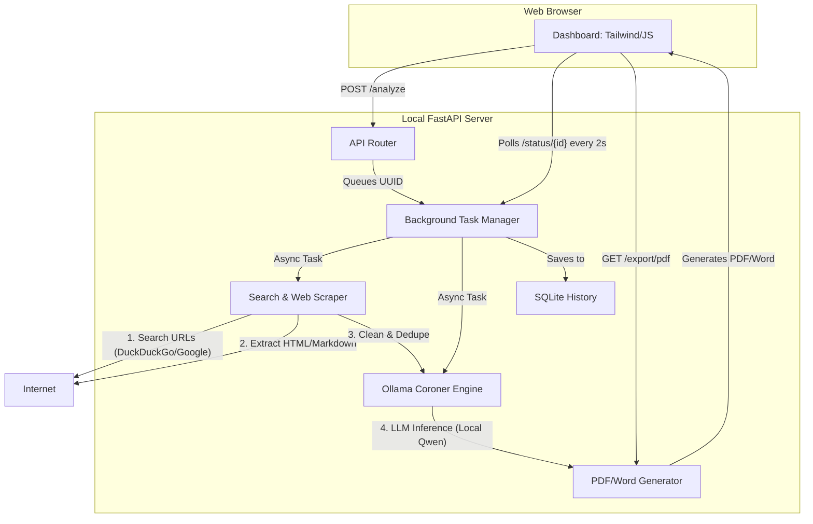

# 🐦🔥 PhoenixForge

> **The Privacy-First Local AI "Project Coroner" and Pre-Mortem Analyzer**

PhoenixForge is a local, privacy-first, AI-driven pre-mortem analysis tool. Given a raw project or startup idea, it autonomously researches failure post-mortems, user complaints, and tech shortcomings across the web. Using a local LLM, it extracts key technical, scaling, B2B, and UX risks, converting these negative signals into actionable, positive pivot strategies.

All processing, scraping, and AI analysis run entirely on your local machine using **Ollama** and a headless browser, ensuring zero cloud data leakage of early-stage intellectual property.

---

## 🚀 Key Features

*   **Autonomous Research Scraper**: Multi-engine search querying (DuckDuckGo & Google) extracting full-text markdown from up to 15 unique targets.
*   **Memory-Safe Sequential Crawling**: Optimized for standard laptops (e.g. 8GB RAM), running single-concurrency tab crawls via `Crawl4AI` with visual resource exclusion.
*   **Incremental Saving**: Handles network failures gracefully. If a target page fails to crawl, it logs the error and continues, preserving the remaining content.
*   **Project Coroner Engine**: Local inference powered by Ollama (`qwen2.5-coder:3b`) extracting specific risks (UX, Tech, Cost) and citing raw sources.
*   **Antidote Pivot Engine**: Proposes specific, structured business pivot strategies to mitigate identified failure risks.
*   **Local Session Vault**: Uses a local SQLite database history vault to store full-text scrapes, heatmaps, and results.
*   **Collapsible Scrapes Panel**: Shows clickable hyperlinks to all scraped source links directly inside the dashboard.
*   **Professional Document Compiler**: Generates formatted PDF and Word (.docx) export reports with source citations and user abandonment flowcharts.

---

## 🛠️ Tech Stack

*   **Frontend**: TailwindCSS, Vanilla JavaScript, Outfit & JetBrains Mono Google Fonts, Mermaid.js
*   **Backend**: FastAPI (ASGI Python web server), Uvicorn
*   **AI Engine**: Ollama (`qwen2.5-coder:3b`)
*   **Web Scraper**: Crawl4AI (Async Playwright Headless Chromium) & BeautifulSoup4 Fallback
*   **Database**: SQLite3
*   **Compilers**: xhtml2pdf / pdfkit, python-docx

---

## ⚙️ Installation & Setup

### Prerequisites
1.  **Python 3.10+**
2.  **Ollama** (Download and run from [ollama.com](https://ollama.com))

### 1. Clone the Repository
```bash
git clone https://github.com/murali19980/PhoenixForge.git
cd PhoenixForge
```

### 2. Install Dependencies
```bash
pip install -r requirements.txt
```

### 3. Initialize Scraper Binaries
Initialize the headless browser binaries required by Crawl4AI / Playwright:
```bash
playwright install chromium
```

### 4. Pull local LLM
Make sure Ollama is running, then pull the required model:
```bash
ollama pull qwen2.5-coder:3b
```

### 5. Run PhoenixForge
Start the FastAPI server:
```bash
python -m uvicorn main:app --host 127.0.0.1 --port 8000 --reload
```
Open your browser and navigate to: **[http://127.0.0.1:8000](http://127.0.0.1:8000)**

---

## 🏛️ High-Level System Architecture

PhoenixForge uses a **Gather → Clean → Organize → Present** pipeline executed asynchronously:



---

## 📄 License & Classification
*   **Classification**: Internal / Confidential Project
*   **Author**: Murali & Antigravity AI
*   **Version**: 3.0 (Final Production Build)
